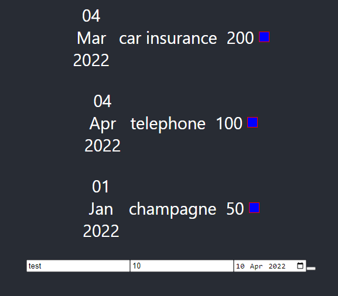

# React demo application

Basic react application based on https://www.udemy.com/course/react-the-complete-guide-incl-redux/



## demo

```sh
npm install
npm start
```

## demo requirements

- A recent version of Node.js `node` (tested with 16 LTS) and its package manager `npm`.
    - On Windows [download](https://nodejs.dev/download/) and run the installer
    - On Linux check the [installation guide](https://www.digitalocean.com/community/tutorials/how-to-install-node-js-on-ubuntu-20-04#option-2-%E2%80%94-installing-node-js-with-apt-using-a-nodesource-ppa)
